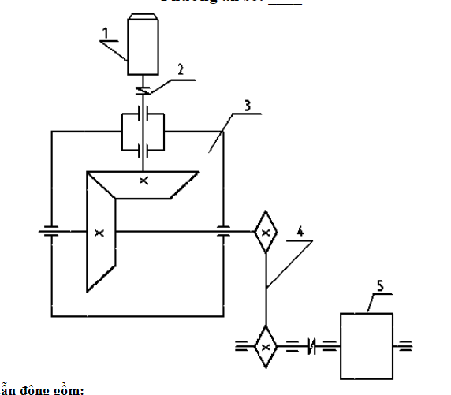
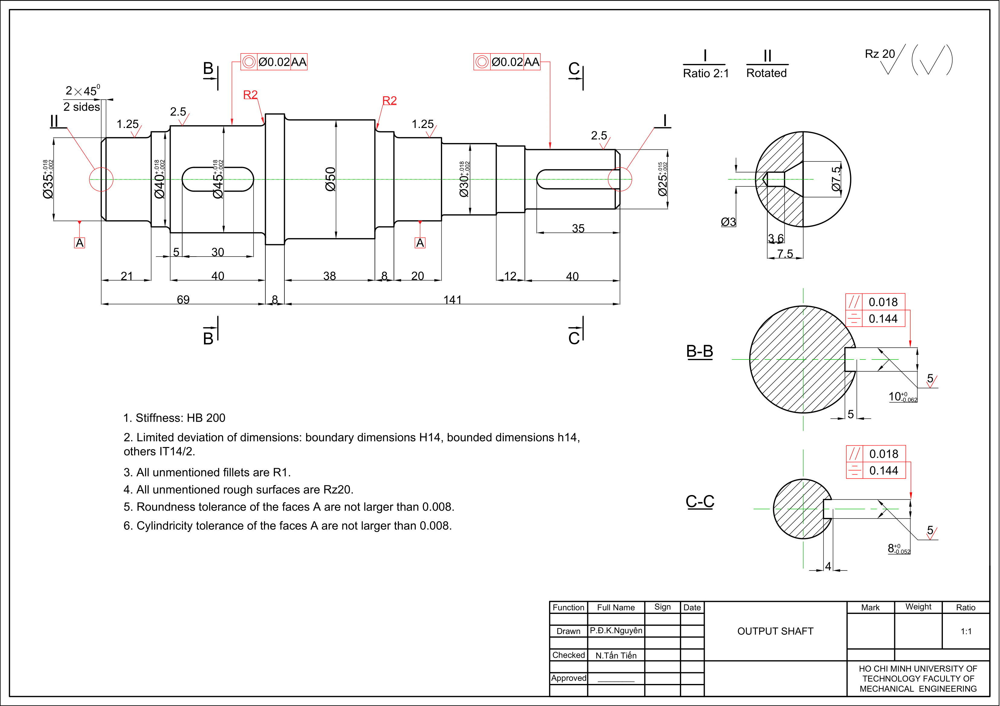

# Single stage helical reducer gearbox
This repository contains all files and documents for the Transmission System Design Project Course at Ho Chi Minh City University of Technology (HCMUT). All drawings are done using AutoCAD Mechanical software.

The requirements are as follow:

All calculations are located in [this paper](Paper.docx).

## Transmission system
The whole system is described in [this assembly drawing](System-Model.pdf).

## Reducer gearbox
The single stage helical reducer gearbox is described in [this assembly drawing](Reducer-Model.pdf).

## Output shaft
The output shaft is described in [this part drawing](Output_Shaft-Model.pdf).

